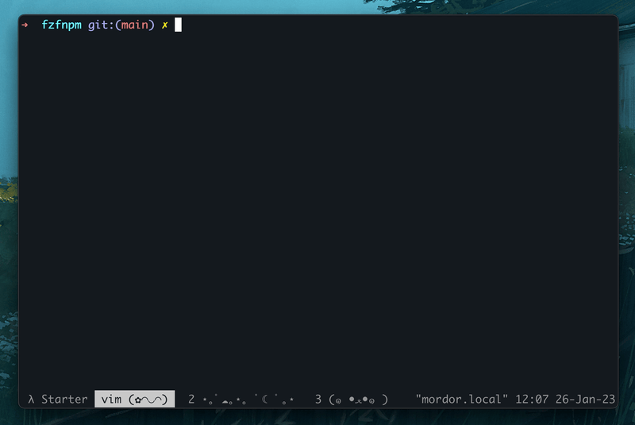

# fzfnpm

A simple way to launch npm scripts from a package.json using fzf.

<p align="center">
  
</p>

> No more `cat package.json` or `npm run` just launch `fzfnpm`.


## Install with homebrew

```bash
brew tap FrancisVega/taps
brew install fzfnpm
```

