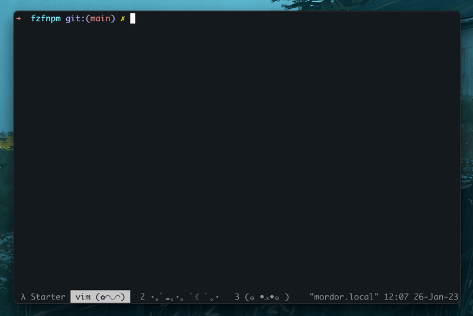

# fzfnpm

A simple way to launch npm scripts from a package.json using fzf.

<p align="center">
  
</p>

> No more `cat package.json` or `npm run` just launch `fzfnpm`.

## Features

- **Smart package manager detection** - Automatically detects npm, yarn, or pnpm
- **Bookmark system** - Your last used script appears at the top for quick access (just press Enter again)
- **Project-specific memory** - Each project remembers its own script history

## Requirements

`fzfnpm` needs [`fzf`](https://github.com/junegunn/fzf) and [`jq`](https://jqlang.github.io/jq/) on your `PATH`:

```bash
# macOS
brew install fzf jq
# Debian/Ubuntu
sudo apt install fzf jq
```

## Install

```bash
curl -fsSL https://raw.githubusercontent.com/FrancisVega/fzfnpmscript/main/install.sh | bash
```

This installs the latest release into `~/.local/bin` (override the directory with `FZFNPM_INSTALL_DIR`). Make sure that directory is on your `PATH`. Pin a specific version with `FZFNPM_VERSION=v0.10.0`.

<details>
<summary>Manual install (latest from <code>main</code>)</summary>

```bash
curl -fsSL https://raw.githubusercontent.com/FrancisVega/fzfnpmscript/main/bin/fzfnpm -o ~/.local/bin/fzfnpm
chmod +x ~/.local/bin/fzfnpm
```

</details>

> **Homebrew (deprecated):** the `FrancisVega/taps` tap is no longer maintained. Use the install script above.

## Uninstall

```bash
fzfnpm --uninstall
```

